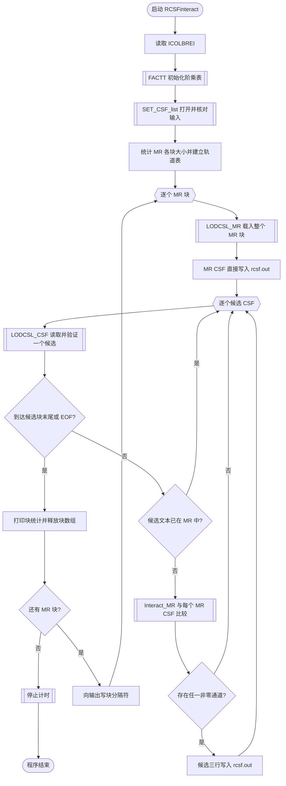
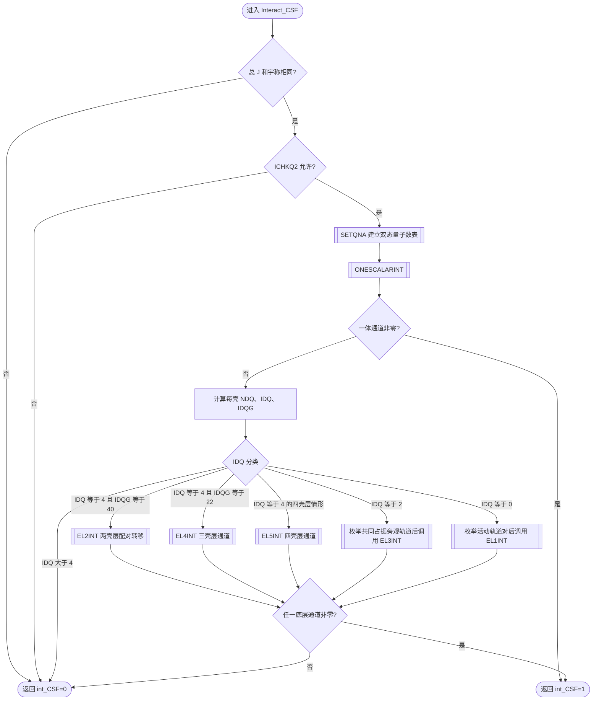
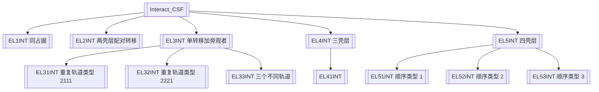
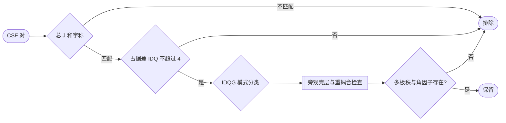

# GRASP2018 `rcsfinteract90` 计算流程分析

## 1. 文档范围与结论

本文基于 GRASP2018 源码树中的 `appl/rcsfinteract90/` 做静态分析，重点跟踪：

- 主程序 `RCSFinteract.f90`；
- 输入和 CSF 内部表示：`set_CSF_number.f90`、`set_CSF_list.f90`、`lodcsl_MR.f90`、`lodcsl_CSF.f90`；
- 相互作用判定：`Interact_MR.f90`、`Interact_csf.f90`；
- 一体算符判定：`onescalarINT.f90`、`onescalar1INT.f90`、`onescalar2INT.f90`、`recoonescalar.f90`；
- 二体算符判定：`el1INT.f90` 至 `el5INT.f90` 及其下级 `el31/32/33INT`、`el41INT`、`el51/52/53INT`；
- GRASP 库提供的解析、选择定则和重耦合例程。

核心结论是：`rcsfinteract` 是一个 **CSF 筛选器**，不是完整矩阵元生成器。它逐个检查 `rcsf.inp` 中的候选 CSF 是否与同一块中的任一 `rcsfmr.inp` 多参考（MR）CSF 存在非零的一体或二体哈密顿量通道。只要找到一个非零通道，它就立即把候选 CSF 的三行文本写入 `rcsf.out`，而不保存角系数或矩阵元数值。

用公式表示其筛选条件：

\[
\operatorname{keep}(\Phi_c)=
\left[\Phi_c\in\mathrm{MR}\right]
\lor
\bigvee_{\Phi_r\in\mathrm{MR\ block}}
\left[\langle\Phi_r|H|\Phi_c\rangle\text{ 存在非零通道}\right].
\]

这里的“非零”是程序通过角动量、宇称、占据数、重耦合和径向积分角因子等必要条件得到的布尔判定；程序在很多位置将原本用于计算系数的数值代码注释掉，只保留 `INTERACT=0/1`。

## 2. 输入、输出与运行参数

### 2.1 文件

| 文件 | Fortran 单元 | 作用 |
|---|---:|---|
| `rcsfmr.inp` | 21 | 多参考 CSF 列表；也是每个块的筛选基准 |
| `rcsf.inp` | 20 | 待筛选的完整或扩展 CSF 列表 |
| `rcsf.out` | 22 | 输出：MR CSF 加上与 MR 相互作用的候选 CSF |
| 标准输入 | 5/`*` | 读取 `ICOLBREI` |
| 标准输出 | 6 | 打印进度与每块统计 |
| 调试输出 | 99 | 若干内部错误或调试信息 |

`SET_CSF_list` 要求两个输入文件具有相同的：

1. `Core subshells:` 头和闭壳层列表；
2. peel subshell 头；
3. peel 轨道列表及其顺序。

因此，两个文件必须使用同一个相对论轨道基和轨道排序。程序按文件中出现的块顺序同步处理两份输入，没有按块标签做重新匹配。

### 2.2 CSF 的三行格式

每个 CSF 由三行组成：

1. `C_shell`：各 peel subshell 的占据数；
2. `C_quant`：子壳层量子数，包含 seniority/子壳层角动量等信息；
3. `C_coupl`：中间耦合角动量、总角动量和末尾宇称 `+`/`-`。

块之间用前两列为 `" *"` 的行分隔。程序把原始三行保存在 `C_shell`、`C_quant`、`C_coupl` 中用于原样输出，同时把物理量压缩到整数数组中用于选择定则计算。

### 2.3 哈密顿量选择

主程序提示用户输入：

- `ICOLBREI = 1`：Dirac–Coulomb；
- `ICOLBREI = 2`：Dirac–Coulomb–Breit。

源码未验证其他输入值。底层 `EL*INT` 主要只实现 `1` 和 `2` 两个分支，因此其他值通常会使可用通道无法把 `INTERACT` 置为 1。

## 3. 总体执行流程

正常路径的关键短路行为是：

- 候选已是 MR：不再计算，避免正常情况下重复输出；
- 一个候选与某个 MR CSF 相互作用：立即输出，不再检查其余 MR；
- 一个角动量/宇称/占据数选择定则失败：立即返回“不相互作用”；
- 一个候选的任一一体或二体通道成立：立即返回“相互作用”。

## 4. 初始化与输入准备

### 4.1 主程序初始化

`RCSFinteract.f90:40-56` 依次执行：

1. `starttime` 开始计时；
2. 从标准输入读取 `ICOLBREI`；
3. 将全局块号 `NBLOCK` 置零；
4. `FACTT` 初始化后续角动量代数所需的阶乘表；
5. `SET_CSF_list(NCORE,NPEEL)` 准备文件、轨道和块计数。

`getinf.f90` 虽被列入构建目标，但主程序没有调用它；它属于从其他 MCP 程序继承的配置逻辑，不参与当前筛选流程。

### 4.2 `SET_CSF_list`：核对两份 CSL 文件

`set_CSF_list.f90:41-101` 的顺序如下：

1. 以单元 21 打开 `rcsfmr.inp`，检查首 15 字符是否为 `Core subshells:`；
2. 以单元 20 打开 `rcsf.inp`，做相同检查；
3. 比较闭壳层字符串，任一字符不同即停止；
4. 打开 `rcsf.out`，先写公共头部；
5. 比较 peel 轨道列表及顺序，不同则 `ERROR STOP`；
6. 写输出文件的 peel 头部。

随后：

- `SET_CSF_number` 预扫描 `rcsfmr.inp`，把每个 MR 块的 CSF 数记录到 `NUM_in_BLK(1:20)`；
- 回卷 `rcsf.inp`；
- `PRSRSL(20,1)` 解析 core subshell，建立 `NP/NAK/NKL/NKJ/NH`；
- `PRSRSL(20,2)` 解析 peel subshell；
- 检查 core 和 peel 集合不相交；
- 得到轨道总数 `NW`、core 轨道数 `NCORE` 和 peel 轨道数（此时的 `NPEEL=NW-NCORE` 是轨道数，后续加载首个 CSF 后被改为 peel 电子数）。

### 4.3 `SET_CSF_number`：预统计 MR 块容量

`set_CSF_number.f90:28-60` 从 MR 数据区开始扫描：

- 每读到一个 CSF，就跳过其余两行并把当前块计数加一；
- 遇到 `" *"`，保存当前块计数并开始下一块；
- EOF 时保存最后一块；
- 最后回卷单元 21，并再次定位到第一个 CSF。

这个预扫描不是计算的一部分，而是为了让 `LODCSL_MR` 能按块精确分配 `NCFD+1` 大小的数组；多出来的一个槽位专门复用来装载当前候选 CSF。

## 5. CSF 解析与内部表示

### 5.1 MR 块加载：`LODCSL_MR`

需要注意，源码中存在两个不同作用域、但同名的 `NPEEL`：

- `SET_CSF_list/LODCSL_MR/LODCSL_CSF` 的形参 `NPEEL` 最终表示 peel 区电子总数，用于检查所有 CSF 的电子数一致；
- `m_C` 模块中的全局 `NPEEL` 由 `SETQNA` 建立，表示当前 CSF 对的活动 peel 壳层/轨道数，`Interact_CSF` 和 `EL*INT` 使用的是这个量。

下文相互作用分支中的 `NPEEL` 均指第二种含义，不能与 peel 电子数混为一谈。

每进入一个块，`LODCSL_MR` 先根据 `NUM_in_BLK(NBLOCK+1)` 分配：

- `Found(NCFD+1)`：记录 MR 项是否已在候选文件中遇到；
- `C_shell/C_quant/C_coupl(NCFD+1)`：原始三行文本；
- `IQA(NNNW,NCFD+1)`：压缩的占据数；
- `JQSA(NNNW,3,NCFD+1)`：压缩的子壳层量子数；
- `JCUPA(NNNW,NCFD+1)`：压缩的逐级耦合量子数及末端 `J^P`。

然后逐个读入 MR CSF，并立即把它的原始三行写到 `rcsf.out`。因此 MR 始终包含在结果中，无需通过相互作用判定。

### 5.2 单个 CSF 的解析步骤

`LODCSL_MR` 与 `LODCSL_CSF` 的核心解析逻辑基本相同：

1. `PRSRCN` 从第一行解析各 peel subshell 占据数 `IOCC`；
2. `PARSJL(1,...)` 从第二行解析子壳层 `J_sub` 和 seniority `ν`；
3. 从第三行末尾取得宇称，再由 `PARSJL(2,...)` 解析中间及最终角动量；
4. core subshell 按满占据写入压缩数组；
5. 对每个 peel subshell：
   - 判断空壳、满壳或开壳；
   - 依据 `JTAB/NTAB` 检查给出的 `ν,J_sub` 是否允许；
   - 按三角条件检查逐级耦合 `JXN`；
   - 用 `PACK` 写入 `IQA/JQSA/JCUPA`；
6. 检查量子数数量既不少也不多；
7. 由 \((-1)^{\sum l_i q_i}\) 重新计算宇称并与文本宇称比较；
8. 检查总角动量和总电子数一致；
9. 计算并存储总电子数 `NELEC`。

压缩数组通过 GRASP 的访问函数暴露为：

| 访问量 | 含义 |
|---|---|
| `IQ(i,csf)` | 第 `i` 个相对论子壳层的占据数 |
| `JQS(1,i,csf)` | seniority/附加子壳层量子数 |
| `JQS(2,i,csf)` | 相关辅助量子数 |
| `JQS(3,i,csf)` | 子壳层角动量编码 |
| `JCUP(i,csf)` | 逐级耦合角动量 |
| `ITJPO(csf)` | 总角动量编码 |
| `ISPAR(csf)` | 总宇称 |

MR 加载器还检查块内重复 CSF；候选加载器每次只把一个候选写到固定槽位 `JB=NCFBLK(NBLOCK)+1`。

### 5.3 候选与 MR 的文本去重

`lodcsl_CSF.f90:116-131` 在完整物理解析之前，先把候选三行与当前 MR 块逐字符比较。如果三行完全相等且对应 `Found(i)==0`：

- 置 `Found(i)=1`；
- `NotFound` 减一；
- 置 `Found_CSF=1` 并返回。

主程序看到 `Found_CSF==1` 后直接跳过候选。这个去重是 **文本级相等**，不是规范化后的量子数级相等。

## 6. 候选对整个 MR 的扫描

`Interact_MR` 固定候选索引：

\[
JB=NCFBLK(NBLOCK)+1,
\]

再令 `JA=1...NCFBLK(NBLOCK)`，逐一调用 `Interact_CSF(JA,JB,ICOLBREI,int_CSF)`。

只要 `int_CSF != 0`：

1. 当前块保留计数 `I_Count` 加一；
2. 把候选三行写入单元 22；
3. 立即返回。

因此每个候选最多输出一次。块统计含义为：

| 输出列 | 含义 |
|---|---|
| `Block` | 当前 `NBLOCK` |
| `MR NCSF` | 当前 MR 块大小 `NCFBLK(NBLOCK)` |
| `Before NCSF` | 候选块读取的三行组数，含已在 MR 中的项 |
| `After NCSF` | `MR NCSF + I_Count` |

## 7. `Interact_CSF` 的分层筛选

### 7.1 快速必要条件

每对 `(JA,JB)` 首先经过：

1. `ITJPO(JA) == ITJPO(JB)`：总角动量相同；
2. `ISPAR(JA) == ISPAR(JB)`：宇称相同；
3. `JA != JB`：此程序只比较不同数组槽；
4. `ICHKQ2(JA,JB) != 0`：两体算符的占据数差异预筛选；
5. `SETQNA(JA,JB)`：建立后续例程使用的成对状态表，包括 `NQ1/NQ2`、`JJQ1/JJQ2`、`JLIST/KLIST`、`JJC1/JJC2` 等。

任何必要条件失败，立即返回 `int_CSF=0`。

### 7.2 先尝试一体标量算符

程序先调用 `ONESCALARINT`。其主要判定是：

- `ICHKQ1` 要求两边至多相差一次单电子转移；
- 对各 peel 壳层计算 `NDQ=NQ1-NQ2`，要求每壳 `|NDQ|<=1`，总差异 `IDQ<=2`；
- `IDQ=2` 表示一个壳层少 1、另一个多 1，交给 `ONESCALAR2INT`；
- `IDQ=0` 表示占据相同，遍历可作用壳层并检查重耦合。当前调用的 `JA` 与 `JB` 是不同 CSF 槽位，代码只在 `JA==JB` 时调用 `ONESCALAR1INT`，所以此路径通常不会把耦合不同但占据相同的两个 CSF 判为一体相互作用；
- `RECOONESCALAR` 检查所有非作用“旁观者”壳层的子壳层量子数与耦合链是否一致；
- `ONESCALAR2INT` 还要求两个活动壳层的单电子角动量编码相同，并通过 `RECO2`。

一体通道一旦令 `INTERACT!=0`，`Interact_CSF` 立即返回成功；否则继续检查二体通道。

### 7.3 占据差异编码 `IDQ` 与 `IDQG`

对每个 peel 轨道：

\[
NDQ_i=NQ1_i-NQ2_i,\qquad IDQ=\sum_i|NDQ_i|.
\]

粒子数守恒使正常的 `IDQ` 为偶数。两体算符一次最多改变两个电子，所以 `IDQ>4` 必为零。

程序还用十进制式编码 `IDQG` 区分差异形状：

- 每个 `|NDQ|=1` 加 `1`；
- 每个 `|NDQ|=2` 加 `20`。

因此 `IDQ=4` 时可区分 `40`（一次 ±2 配对转移）、`22`（一侧 ±2，另一侧两个 ∓1）和 `4`（四个壳层各 ±1）。

### 7.4 二体分支总表

| `IDQ` | 占据关系 | 活动壳层形态 | 调用 | 物理含义 |
|---:|---|---|---|---|
| 0 | 两 CSF 占据完全相同 | 两个活动/旁观轨道组合 | `EL1INT` | 同组态、耦合不同的二体通道 |
| 2 | 一个壳层 `+1`、一个 `-1` | 固定单电子转移，再枚举一个共同占据的旁观轨道 | `EL3INT` | 单激发由二体算符连接 |
| 4, `IDQG=40` | 一个壳层 `+2`、一个 `-2` | 两壳层 | `EL2INT` | 电子对整体转移 |
| 4, `IDQG=22` | 一个壳层变化 2，两个壳层各变化 1 | 三壳层 | `EL4INT` → `EL41INT` | 三个不同活动壳层 |
| 4, 其他（通常 `4`） | 四个壳层各变化 1 | 四壳层 | `EL5INT` → `EL51/52/53INT` | 一般双激发 |
| >4 | 超过二体算符能力 | — | 直接返回 0 | 不相互作用 |

### 7.5 `IDQ=0/2` 时的旁观轨道与 core 项

`IDQ=0` 时没有由占据差异唯一确定的活动壳层，程序枚举 peel 轨道对，并排除占据不足以湮灭电子的组合。`IDQ=2` 时单电子转移的源和目标已固定，程序再枚举两边共同占据的轨道，形成二体算符中的第二个电子。

随后还会处理闭 core 轨道贡献：

1. 备份 `JLIST/JJC1/JJC2`；
2. 按轨道顺序把一个 core 轨道临时插入 peel 耦合链；
3. 临时令 `NPEEL=NPEEL+1`；
4. 调用 `EL3INT`（`IDQ!=0`）和/或 `EL1INT`；
5. 恢复 `NPEEL` 及耦合数组。

这使“活动电子与闭壳层电子组成二体作用”的项也能被判定。

## 8. `EL*INT` 家族如何得到布尔结果

### 8.1 调用层次

`EL3INT`、`EL4INT`、`EL5INT` 主要是分派器：它们根据活动轨道是否相同以及轨道序号顺序，把参数排列成底层例程所要求的规范形式。

### 8.2 每个底层例程的共同算法骨架

尽管不同占据模式的角动量公式不同，`EL1/2/31/32/33/41/51/52/53INT` 共享以下判定步骤：

1. **重耦合可行性**：`RECO` 检查非活动壳层和耦合树是否能重耦合；失败即返回；
2. **提取活动壳层量子数**：`PERKO2` 填充 `ID1...ID4` 等活动壳层表；
3. **更高阶重耦合**：按壳层数调用 `RECO2`、`REC3` 或 `RECO4`；
4. **允许的多极秩范围**：`ITREXG` 生成多极秩 `k` 的范围；`IKK<=0` 表示没有允许值；
5. **三角/6-j 类选择定则**：`ITRIG`、`IXJTIK` 等排除角动量不允许的组合；
6. **遍历多极秩和中间角动量**：只要存在一个允许组合即可成功，不需要累加最终矩阵元；
7. **依据 `ICOLBREI` 判定径向/角向通道**；
8. 任一组合成立便设置 `INTERACT=1` 并短路返回。

### 8.3 Coulomb 与 Breit 两条代码路径

当 `ICOLBREI=1`：

- 调用 `COULOM(...)` 计算给定轨道组合和多极秩的 Coulomb 角因子 `A1`；
- 若 `|A1|<EPS`，该组合跳过；
- 同时要求重耦合和中间角动量条件成立；
- 存在一个组合时令 `INTERACT=1`。

当 `ICOLBREI=2`：

- 由轨道的 `NAK` 构造 `KAPS=2*NAK` 和 `KS=|KAPS|`；
- `SNRC` 判断允许的直接/交换径向通道，输出 `IBRD/IBRE`；
- 若所需通道均不存在则返回；
- 在后续重耦合与多极秩条件成立时直接令 `INTERACT=1`，不再用 `COULOM` 的 `A1` 阈值做相同判断。

因此此处的“计算”已经被简化为 **存在性测试**。源码中许多原本计算 `GG...`、相位、重耦合系数和最终系数的语句被注释，并以 `PMGG=ONE` 或计数器非零替代。文档或调用方不应把 `INTERACT=1` 理解为矩阵元大小，只能理解为该实现认为至少存在一个允许通道。

### 8.4 各例程覆盖的占据模式

| 例程 | 覆盖模式（以两边占据变化描述） |
|---|---|
| `EL1INT` | 占据不变；同一或两个活动轨道的直接/交换项 |
| `EL2INT` | `-2,+2` 的两轨道配对转移 |
| `EL31INT` | 单转移，二体轨道标签形如 `2111/1211` |
| `EL32INT` | 单转移，二体轨道标签形如 `2221/2212` |
| `EL33INT` | 单转移并涉及第三个不同轨道 |
| `EL41INT` | `+1,+1,-2` 或反向的三轨道双激发 |
| `EL51INT` | 四轨道变化的 `--++` 排列族 |
| `EL52INT` | 四轨道变化的 `-+-+` 排列族 |
| `EL53INT` | 四轨道变化的 `-++-` 排列族 |

`IREZ` 用于表示某个规范排列的正向或反向占据变化；分派器通过交换活动轨道参数复用同一底层公式。

## 9. 块结束、输出和资源释放

候选块遇到 `" *"` 或 EOF 时，`LODCSL_CSF` 令 `NEXT_CSF=.FALSE.`。主程序随后：

1. 打印当前块的 MR 数、筛选前数、筛选后数；
2. 释放 `Found/C_shell/C_quant/C_coupl/IQA/JQSA/JCUPA`；
3. 若 MR 文件还有下一块，向输出写 `" *"` 并继续；
4. 最后一块完成后停止计时并结束。

输出保留输入的头、块结构和 CSF 三行表示。正常情况下，每块内容为：

1. 该块全部 MR CSF；
2. 按 `rcsf.inp` 原顺序出现、且至少与一个 MR CSF 相互作用的非 MR 候选。

## 10. 正常路径与边界路径

### 10.1 正常路径

- 两输入头、闭壳层和 peel 轨道顺序一致；
- 每个块由合法三行 CSF 组成；
- 候选和对应 MR 块具有相同总 `J^P`；
- 候选至多是相对某个 MR 的双激发，或占据相同但耦合不同；
- 底层至少找到一个允许的一体/二体角动量通道；
- 候选被写入输出，之后继续下一个候选。

### 10.2 被正常排除的情况

- 总角动量或宇称不同；
- `ICHKQ1/ICHKQ2` 判定占据差异超出一体/二体算符范围；
- 某壳层 `|NDQ|>2` 或总 `IDQ>4`；
- 旁观壳层量子数/耦合不一致；
- 三角条件、多极秩范围或重耦合条件不成立；
- Coulomb 模式下所有 `COULOM` 角因子小于 `EPS`；
- DCB 模式下 `SNRC` 不给出所需通道。

### 10.3 输入错误导致停止

- 输入文件打不开；
- 两文件闭壳层或 peel 轨道顺序不同；
- core 与 peel 轨道集合相交；
- CSF 三行不完整；
- 子壳层量子数、角动量耦合、宇称或电子数不一致；
- MR 块内存在重复的规范 CSF；
- `EL3/4/5INT` 遇到未覆盖的活动轨道排列。

## 11. 静态分析发现的实现风险

以下内容记录源码当前行为，未在本次文档工作中修改。

### 11.1 `NPEEL==1` 二体路径使用未初始化的 `IDQG`

`Interact_csf.f90:81-126` 在 `NPEEL==1` 分支中于第 96 行读取 `IDQG`，但 `IDQG=0` 的初始化位于该分支之后的第 137 行。若一体判定未提前成功，这里的分支结果依赖未定义值。

### 11.2 临时插入 core 轨道后，成功短路可能绕过状态恢复

`Interact_csf.f90:364-404` 临时执行 `NPEEL=NPEEL+1` 并修改 `JLIST/JJC1/JJC2`。若 `EL3INT` 或 `EL1INT` 得到 `INTERACT!=0`，代码在恢复语句之前直接 `RETURN`。后续候选可能看到未恢复的全局 `NPEEL` 和耦合表。这是跨候选状态污染风险。

### 11.3 `Interact_CSF` 接口块与实现不一致

- 实现：`Interact_CSF(JA,JB,ICOLBREI,int_CSF)`，4 个参数；
- `Interact_csf_I.f90`：声明 `Interact_CSF(JA,JB,INCOR,ICOLBREI,int_CSF)`，5 个参数。

当前 `Interact_MR` 没有 `USE Interact_CSF_I`，所以调用绕过显式接口检查并按 4 参数工作；其他调用者若使用该接口模块，会产生编译或调用约定问题。

### 11.4 输出文件打开状态与关闭单元号可疑

`SET_CSF_list` 以 `STATUS='OLD'` 打开 `rcsf.out`。若 `OPENFL` 保持标准 Fortran 语义，则输出文件必须预先存在，并且打开后未显式指定截断行为。主程序最终 `CLOSE(24)`，而实际输出单元是 22；单元 22 没有显式关闭，只能依赖程序结束时运行时关闭/刷新。

### 11.5 EOF 前先检查 `RECORD`

两个加载器都在 `READ(...,IOSTAT=IOS) RECORD` 后先访问 `RECORD(1:2)`，再进入 `IOS==0` 分支。EOF 或读取失败时 `RECORD` 的内容不应被当作有效新记录；虽然通常随后走 EOF 路径，但这种顺序依赖编译器/运行时对失败读取后变量值的处理。

### 11.6 块数硬上限未检查

`NUM_in_BLK` 固定长度为 20，`SET_CSF_number` 在增加 `I_Num_BLK` 时没有边界检查。超过 20 个 MR 块会越界。

### 11.7 不可达语句与遗留代码

- `Interact_csf.f90:70-74` 在 `NPEEL==0` 时先 `RETURN`，之后的诊断 `PRINT/STOP` 不可达；
- `getinf.f90` 被编译但主流程未调用；
- 大量数值系数计算被注释，只保留布尔存在性判定；
- 多处错误信息仍为早期开发语言或含义不清的占位文本，不利于定位异常输入。

### 11.8 文本去重的局限

候选是否属于 MR 通过三行固定长度字符串完全相等判断。等价但空格布局不同的 CSF 不会被识别为同一 MR 项；反过来，`Found` 只允许每个 MR 文本命中一次，候选文件中的重复项可能在第二次出现时进入相互作用计算。

## 12. 与 `rCSFs` 的关系

`rCSFs` 目前把 CSF 的三行记录转换为 Parquet，并从占据、子壳层量子数和耦合信息生成描述符。`rcsfinteract90` 的流程说明了未来若要在 Rust 侧复现或加速“相互作用筛选”，仅比较描述符的占据差异还不够：

1. `IDQ<=4` 只能作为非常便宜的首层预筛选；
2. 必须保留总 `J^P`、子壳层 `J/ν` 和逐级耦合链；
3. 必须实现或绑定 `RECO/RECO2/REC3/REC4` 等重耦合判定；
4. Coulomb/DCB 模式还需要等价的多极秩、角因子和 `SNRC` 通道判定；
5. 结果语义应明确为“存在允许通道”，不能标成矩阵元数值；
6. 若只实现基于占据差的预筛选，应把输出称为候选上界集合，因为它会包含角动量代数最终判零的假阳性。

一个适合高性能实现的分层漏斗是：

前两层适合用 `rCSFs` 的列式数据并行执行；后两层需要完整的 GRASP 角动量语义，不能由当前固定长度 ML 描述符无损替代。

## 13. 源码索引

| 阶段 | 主要源码位置 |
|---|---|
| 主循环 | `RCSFinteract.f90:40-85` |
| 文件和轨道准备 | `set_CSF_list.f90:41-150` |
| MR 块计数 | `set_CSF_number.f90:28-60` |
| MR 加载与校验 | `lodcsl_MR.f90:72-428` |
| 候选加载与 MR 文本去重 | `lodcsl_CSF.f90:71-433` |
| 对 MR 的短路扫描 | `Interact_MR.f90:43-53` |
| 顶层选择定则及 `IDQ` 分派 | `Interact_csf.f90:50-407` |
| 一体算符 | `onescalarINT.f90:51-202` |
| 二体同占据/二壳层 | `el1INT.f90`、`el2INT.f90` |
| 单转移分派 | `el3INT.f90`、`el31INT.f90`、`el32INT.f90`、`el33INT.f90` |
| 三壳层分派 | `el4INT.f90`、`el41INT.f90` |
| 四壳层分派 | `el5INT.f90`、`el51INT.f90`、`el52INT.f90`、`el53INT.f90` |
| 共享筛选状态 | `lib/libmod/rang_Int_C.f90` |

本文是静态执行流分析；未用实际 GRASP 输入运行数值对照测试，也未覆盖 `librang90`、`lib9290` 和 `libmod` 中所有角动量库例程的数学推导。若要验证移植实现，建议构造覆盖 `IDQ=0/2/4`、`IDQG=40/22/4`、Coulomb/DCB 以及 core 旁观轨道的最小 CSF 对，并以原程序输出作为回归基准。
