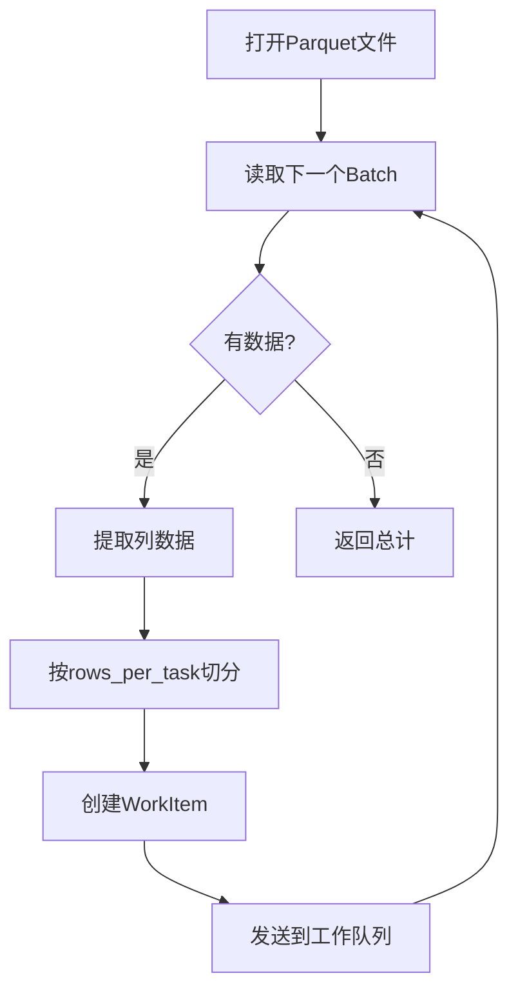

# 代码Review：并行描述符计算实现

**文件**: `src/csfs_descriptor.rs`
**日期**: 2025-12-28
**主题**: CSF描述符并行计算架构分析

---

## 架构概览

这个文件实现了一个**生产者-消费者模式的三阶段流水线架构**来并行计算CSF描述符。

```
┌─────────────────┐    ┌───────────────────┐    ┌─────────────────┐
│  Reader Thread  │───▶│  Worker Threads   │───▶│  Writer Thread  │
│  (生产者)        │    │  (N个并行处理)      │    │  (顺序写入)      │
└─────────────────┘    └───────────────────┘    └─────────────────┘
      │                           │                        │
      ▼                           ▼                        ▼
 读取Parquet               并行解析CSF            BTreeMap排序
 发送WorkItem              生成Descriptor         写入Parquet
```

### 主要函数对比

| 函数 | 位置 | 模式 | 特点 |
|------|------|------|------|
| `generate_descriptors_from_parquet` | 第126-282行 | 串行 | 单线程处理，适合小数据集 |
| `generate_descriptors_from_parquet_parallel` | 第316-409行 | 并行 | 多线程流水线，适合大数据集 |

---

## 关键组件

### 1. 数据结构定义

**位置**: `csfs_descriptor.rs:289-302`

```rust
/// 工作项：从Reader发送到Worker
#[derive(Debug)]
struct DescriptorWorkItem {
    batch_idx: usize,           // 批次索引（用于排序）
    start_row_in_batch: usize,  // 批次内起始行
    rows: Vec<(u64, String, String, String)>, // (idx, line1, line2, line3)
}

/// 处理结果：从Worker发送到Writer
#[derive(Debug)]
struct DescriptorResult {
    batch_idx: usize,
    start_row_in_batch: usize,
    descriptors: Vec<Vec<f32>>,
}
```

**设计要点**：
- 保留原始位置信息 `(batch_idx, start_row_in_batch)`
- 用于Writer线程按顺序重组乱序到达的结果

---

### 2. Channel配置

**位置**: `csfs_descriptor.rs:325-337`

```rust
let work_queue_size = num_workers * 2;

// 有界工作队列 - 防止内存爆炸
let (work_sender, work_receiver) = bounded::<DescriptorWorkItem>(work_queue_size);

// 无界结果队列 - 防止死锁
let (result_sender, result_receiver) = crossbeam_channel::unbounded::<DescriptorResult>();
```

**设计考虑**：

| Channel | 类型 | 大小 | 原因 |
|---------|------|------|------|
| 工作队列 | 有界 | `num_workers * 2` | 防止Reader过快生产导致内存爆炸 |
| 结果队列 | 无界 | 无限 | 避免Worker阻塞导致死锁（Writer可能慢） |

---

### 3. Reader线程（生产者）

**位置**: `csfs_descriptor.rs:455-546`

```rust
fn reader_thread(
    input_parquet: PathBuf,
    work_sender: Sender<DescriptorWorkItem>,
    total_csfs: Arc<Mutex<usize>>,
    rows_per_task: usize,
) -> Result<usize, String>
```

**工作流程**：



**代码片段**：

```rust
loop {
    match reader.next() {
        Some(Ok(batch)) => {
            // 将批次切分为rows_per_task大小的任务
            let mut start_row = 0;
            while start_row < batch_size {
                let end_row = (start_row + rows_per_task).min(batch_size);

                // 提取行数据
                let mut rows = Vec::with_capacity(end_row - start_row);
                for i in start_row..end_row {
                    rows.push((
                        idx_col.value(i),
                        line1_col.value(i).to_string(),
                        line2_col.value(i).to_string(),
                        line3_col.value(i).to_string(),
                    ));
                }

                work_sender.send(work_item)?;
                start_row = end_row;
            }
        }
        None => break,
    }
}
```

**特点**：
- ✅ **流式读取**：逐批读取，不一次性加载全部数据
- ✅ **任务分块**：按 `rows_per_task` 切分，提高并行度
- ✅ **反压控制**：队列满时阻塞，防止内存爆炸

---

### 4. Worker线程（计算）

**位置**: `csfs_descriptor.rs:411-442`

```rust
fn descriptor_worker(
    _worker_id: usize,
    work_receiver: Receiver<DescriptorWorkItem>,
    result_sender: Sender<DescriptorResult>,
    generator: Arc<CSFDescriptorGenerator>,
)
```

**工作流程**：

```
┌─────────────────────────────────────────────────────┐
│  Worker线程循环 (N个并发)                             │
│                                                      │
│  for work_item in work_receiver {                   │
│      1. 接收WorkItem                                 │
│      2. 遍历rows，逐个调用 parse_csf()               │
│      3. 收集descriptors                             │
│      4. 发送DescriptorResult                        │
│  }                                                   │
└─────────────────────────────────────────────────────┘
```

**代码片段**：

```rust
for work_item in work_receiver {
    let mut descriptors = Vec::with_capacity(work_item.rows.len());

    for (idx, line1, line2, line3) in work_item.rows {
        match generator.parse_csf(&line1, &line2, &line3) {
            Ok(descriptor) => {
                descriptors.push(descriptor);
            }
            Err(e) => {
                eprintln!("Warning: Failed to parse CSF at index {}: {}", idx, e);
                // ⚠️ 错误处理：填充零值
                descriptors.push(vec![0.0f32; descriptor_size]);
            }
        }
    }

    result_sender.send(result).unwrap();
}
```

**特点**：
- ✅ **共享只读状态**：`Arc<CSFDescriptorGenerator>` 无需加锁
- ⚠️ **错误处理**：解析失败时填充零值（可能引入噪声）

---

### 5. Writer线程（消费者）

**位置**: `csfs_descriptor.rs:548-657`

**核心机制：顺序保证**

```rust
fn writer_thread(
    output_parquet: PathBuf,
    result_receiver: Receiver<DescriptorResult>,
    descriptor_count: Arc<Mutex<usize>>,
    descriptor_size: usize,
    rows_per_task: usize,
) -> Result<WriterResult, String>
```

**顺序保证算法**：

```rust
// BTreeMap按键自动排序
let mut pending_results: BTreeMap<(usize, usize), Vec<Vec<f32>>> = BTreeMap::new();
let mut next_write_idx = (0usize, 0usize); // (batch_idx, start_row_in_batch)

for result in result_receiver {
    let key = (result.batch_idx, result.start_row_in_batch);
    pending_results.insert(key, result.descriptors);

    // 按序写入连续结果
    while let Some(descs) = pending_results.remove(&next_write_idx) {
        // 转换为Arrow列式格式
        let column_arrays: Vec<Arc<dyn Array>> = (0..descriptor_size)
            .map(|col_idx| {
                let values: Vec<f32> = descs.iter()
                    .map(|desc| desc[col_idx])
                    .collect();
                Arc::new(Float32Array::from(values)) as Arc<dyn Array>
            })
            .collect();

        // 写入Parquet
        writer.write(&output_batch)?;

        // 计算下一个期望的索引
        let (curr_batch_idx, curr_start_row) = next_write_idx;

        if curr_start_row == 0 {
            // 检查是否有拆分批次 (batch_idx, rows_per_task)
            let split_key = (curr_batch_idx, rows_per_task);
            if pending_results.contains_key(&split_key) {
                next_write_idx = (curr_batch_idx, rows_per_task);
            } else {
                next_write_idx = (curr_batch_idx + 1, 0);
            }
        } else {
            // 刚写入拆分批次的第二部分，移动到下一批次
            next_write_idx = (curr_batch_idx + 1, 0);
        }
    }
}
```

**BTreeMap状态示例**：

```
场景: rows_per_task = 1000, batch_size = 2500

待写入序列: (0,0) → (0,1000) → (0,2000) → (1,0) → ...

当前 next_write_idx = (0, 0)
pending_results = {
    (0, 1000): [...],  // 已到达，但(0,0)还没到，需等待
    (1, 0):    [...],  // 已到达，但前面还有未处理的
    (0, 2000): [...],  // 已到达，但前面还有未处理的
}

当 (0, 0) 到达后 → 写入 → next_write_idx = (0, 1000) → 写入 → ...
```

**特点**：
- ✅ **乱序处理**：使用 `BTreeMap` 自动排序
- ✅ **序列写入**：保证输出文件顺序正确
- ⚠️ **内存积累**：如果某个结果永久丢失，`pending_results` 会无限增长

---

## 并行初始化流程

**位置**: `csfs_descriptor.rs:343-398`

```rust
// Step 1: 启动Worker线程池
let mut worker_handles = Vec::new();
for worker_id in 0..num_workers {
    let handle = thread::spawn(move || {
        descriptor_worker(worker_id, work_receiver, result_sender, generator);
    });
    worker_handles.push(handle);
}

// Step 2: 启动Reader和Writer线程（并发运行）
let reader_thread = thread::spawn({ /* ... */ });
let writer_thread = thread::spawn({ /* ... */ });

// Step 3: 丢弃sender副本，让channel正确关闭
drop(work_sender);
drop(result_sender);

// Step 4: 等待完成
let csf_count = reader_thread.join().unwrap()?;
let result = writer_thread.join().unwrap()?;

for handle in worker_handles {
    handle.join().unwrap();
}
```

**线程join顺序至关重要**：
1. 先等待 Reader 完成（所有任务已发送）
2. 再等待 Writer 完成（所有结果已写入）
3. 最后等待 Workers（会在channel关闭时自动退出）

---

## 性能调优参数

**位置**: `csfs_descriptor.rs:323-325`

```rust
let num_workers = num_workers.unwrap_or_else(|| num_cpus::get());
let rows_per_task = rows_per_task.unwrap_or(1000);
let work_queue_size = num_workers * 2;
```

| 参数 | 默认值 | 说明 |
|------|--------|------|
| `num_workers` | `num_cpus::get()` | CPU核心数，与物理核心匹配通常最优 |
| `rows_per_task` | 1000 | 每个任务处理的行数，影响负载均衡 |
| `work_queue_size` | `num_workers * 2` | 队列深度，影响反压效果 |

---

## 潜在问题与建议

| # | 问题 | 位置 | 严重程度 | 建议 |
|---|------|------|----------|------|
| 1 | **错误处理填充零值** | `csfs_descriptor.rs:429` | 中 | 考虑记录失败索引或使用Option类型 |
| 2 | **BTreeMap内存积累** | `csfs_descriptor.rs:585` | 低 | 添加超时机制或最大缓存大小 |
| 3 | **无超时保护** | 全局 | 低 | 添加全局超时，防止永久阻塞 |
| 4 | **缺少进度报告** | 全局 | 低 | 添加进度回调或日志 |

---

## 性能特性

| 特性 | 串行版本 | 并行版本 |
|------|----------|----------|
| 内存占用 | O(batch_size) | O(work_queue_size × rows_per_task) |
| CPU利用率 | 单核 | 多核 |
| 延迟 | 低 | 中等（有排序开销） |
| 吞吐量 | 中 | 高 |
| 适用场景 | 小数据集 | 大数据集（>100K CSF） |

---

## 总结

这是一个**设计良好的流式+并行混合架构**：

**优点**：
- ✅ 内存高效：流式读取Parquet，不一次性加载全部数据
- ✅ CPU高效：多线程并行解析，充分利用多核
- ✅ 正确性保证：BTreeMap + 序列写入确保输出顺序
- ✅ 反压控制：有界工作队列防止内存爆炸
- ✅ 优雅关闭：正确的线程join顺序避免死锁

**适用场景**：
- 大规模CSF文件（>10万条记录）
- 多核CPU环境
- 对吞吐量要求高的场景

**不适用场景**：
- 小数据集（并行开销 > 收益）
- 内存极度受限的环境
