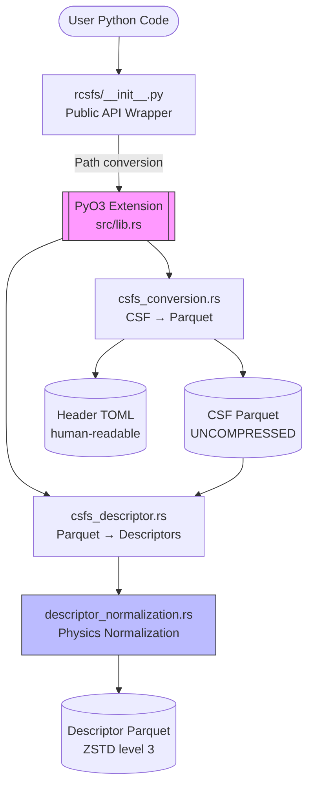
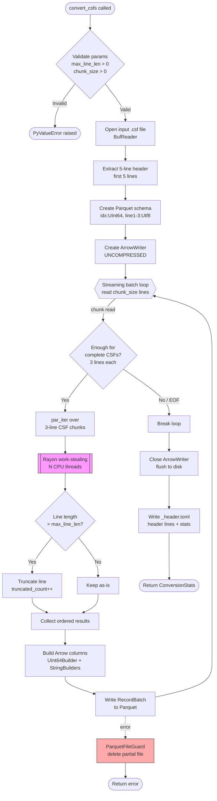
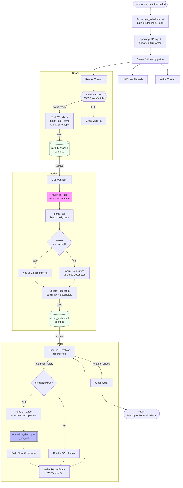
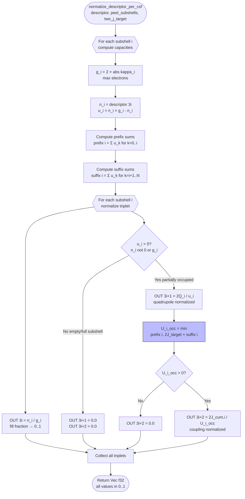
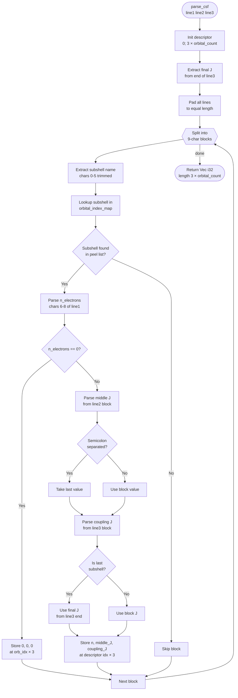

# rCSFs Code Execution Flow Diagrams

## Diagram 1: Top-Level Architecture

---

## Diagram 2: CSF Conversion Pipeline (`convert_csfs`)

---

## Diagram 3: Descriptor Generation Pipeline (`generate_descriptors_from_parquet`)

---

## Diagram 4: Per-CSF Physics Normalization (`normalize_descriptor_per_csf`)

---

## Diagram 5: `parse_csf` — Single CSF Parsing

---

## Logic Breakdown

**Happy Path:**
- `convert_csfs` → reads text, chunks into batches, rayon-parallelizes line truncation, writes ordered Parquet
- `generate_descriptors_from_parquet` → 3-thread pipeline (reader → workers → writer) with rayon inside workers
- `normalize_descriptor_per_csf` → per-CSF u-vector calculation, prefix/suffix sums, three normalized scalars per orbital

**Edge Cases:**
- Lines exceeding `max_line_len` — truncated, counted, file still produced
- Incomplete CSF (not multiple of 3 lines) at EOF — silently dropped
- `parse_csf` failure — all-zeros substituted with a warning, pipeline continues
- Empty or fully-filled subshell (`u_i = 0`) — normalization outputs `0.0` (physically correct, not NaN)
- Out-of-order batch results from workers — BTreeMap in writer enforces batch ordering

---

## Potential Issues

| Location | Issue | Risk |
|---|---|---|
| `csfs_conversion.rs` EOF | Partial CSF at end is **silently dropped** — no warning emitted | Silent data loss if file is malformed |
| `csfs_descriptor.rs` writer | BTreeMap grows unbounded if a worker stalls and results arrive out-of-order | Memory spike on very large files with slow workers |
| `descriptor_normalization.rs` | `two_j_target` is read from `descriptor[descriptor_len - 1]`; if descriptor is empty, this panics | Panic on malformed input with zero orbitals |
| `parse_csf` | 9-char fixed-width chunking assumes exact column alignment — misaligned CSF files produce wrong data silently | Silent corruption on non-standard CSF files |
| Python wrapper | `num_workers=None` passes through to Rust which uses `rayon::current_num_threads()` — no user visibility into actual thread count | Hard to reproduce performance issues |
